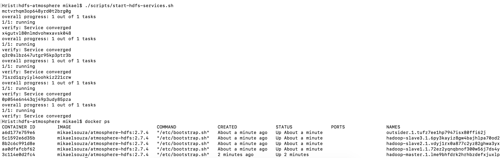

# Configuração do Ambiente Docker para HDFS

Caso haja necessidade de executar o Docker com administrador, modificar comandos abaixo inserido `sudo` no inicio dos comandos.

## 1. Download da Imagem do HDFS:

A imagem Docker utilizada por ser obtida a do comando:

```bash
docker pull mikaelsouza/atmosphere-hdfs:2.7.4
```

## 2. Inicialização de Cluster com Swarm:

```
docker swarm init --advertise-addr 127.0.0.1
docker network create --driver overlay swarm-net
```

## 3. Inicialização de Serviços:

O script `scripts/start-hdfs-services.sh` inicializará os serviços Docker necessários para essa demonstração. Entre os containers criados, estão:

* 1 nó mestre (hadoop-master) para controle do HDFS;
* 3 nós auxiliares (hadoop-slave) para distribuição dos dados no HDFS;
* 1 nó externo (outsider) para execução do programa Java.

Para inicializar o script*, basta executar o comando**:

```
./scripts/start-hdfs-services.sh
```
\* Caso haja erro de permissão negada, dê permissões de execução para o script com o comando `chmod +x ./scripts/start-hdfs-services.sh` e tente novamente.

\** Note que o comando considera o diretório atual como o `root` do projeto.

Caso ocorra tudo corretamente, os 5 containers deverão estar em execução como na figura 1 abaixo.



```
docker exec -it $(docker ps -f name=master -q) bash
```