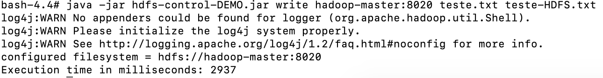

# 1. Configuração do Ambiente Docker para HDFS

Caso haja necessidade de executar o Docker com administrador, modificar comandos abaixo inserido `sudo` no inicio dos comandos.

## 1.1 Download da Imagem do HDFS:

A imagem Docker utilizada por ser obtida a do comando:

```bash
docker pull mikaelsouza/atmosphere-hdfs:2.7.4
```

## 1.2. Inicialização de Cluster com Swarm:

```
docker swarm init --advertise-addr 127.0.0.1
docker network create --driver overlay swarm-net
```

## 1.3. Inicialização de Serviços:

O script `scripts/start-hdfs-services.sh` inicializará os serviços Docker necessários para essa demonstração. Entre os containers criados, estão:

* 1 nó mestre (hadoop-master) para controle do HDFS;
* 3 nós auxiliares (hadoop-slave) para distribuição dos dados no HDFS;
* 1 nó externo (outsider) para execução do programa Java.

Para inicializar o script*, basta executar o comando**:

```
./scripts/start-hdfs-services.sh
```
\* Caso haja erro de permissão negada, dê permissões de execução para o script com o comando `chmod +x ./scripts/start-hdfs-services.sh` e tente novamente.

\** Note que o comando considera o diretório atual como o `root` do projeto.

Caso ocorra tudo corretamente, os 5 containers deverão estar em execução como na figura abaixo.


## 1.4 Entrando no Nó Mestre:

Para realizar o controle dos nós auxiliares e formatar o HDFS, é necessário executar alguns comandos dentro do nó mestre.

Para isso, você pode entrar no nó mestre utilizando o comando abaixo:

```
docker exec -it $(docker ps -f name=master -q) bash
```

## 1.5 Configurando Nó Mestre:

Dentro da pasta `root` há um script `hdfs-init.sh` que cuidará das configurações finais realizadas no Nó Mestre.

Para executar esse script é necessário dar permissões para execução e então executa-lo. Isso pode ser feito com os comandos abaixo:

```
chmod +x /root/hdfs-init.sh
/root/hdfs-init.sh
```

Isso formatará o HDFS e inicializará os Namenodes dos nós auxiliares. Após a execução do script, você poderá sair do Nó Mestra usando o comadno `exit`.

# 2. Executando Programa de PUT/GET Java

## 2.1 Copiando Programa para Nó Externo:

Para simular um container fora do HDFS, mas conectado na mesma rede, utilizamos um container chamado `outsider` para executar o programa java incluso nessa demonstração. 

O arquivo `jars/hdfs-control-DEMO.jar` é o programa que deve ser copiado para dentro do container `outsider`. Isso pode ser realizado a partir do comando abaixo:

```bash
docker cp jars/hdfs-control-DEMO.jar $(docker ps -f name=outsider -q):/root/
```

Isso copiará o arquivo `hdfs-control-DEMO.jar` para a pasta `/root/` contida dentro do container `outsider`.

## 2.2 Entrando no Nó Externo:

De forma similar a maneira usada para entrar no Nó Mestre, executaremos o comando abaixo para executar o `bash` dentro do container `outsider`.

```
docker exec -it $(docker ps -f name=outsider -q) bash
```

Dentro do nó mestre, vamos para a pasta `/root/` onde nosso programa está localizado.

```bash
cd /root/
```

## 2.3 Utilizando Programa Java:

Para executar o programa deve-se utilizar o comando `java -jar hdfs-control-DEMO.jar`. Isso mostrará o formato esperado para os comandos de entrada:

```
bash-4.4# java -jar hdfs-control-DEMO.jar 
Expected format: [read|write] ip:port [hdfs input path|local input path] [local output path|hdfs output path]
```

Como descrito na mensagem de formato, temos os seguintes argumentos necessários a serem passados ao programa:

* `read/write`: Opção que descreve se vamos escrever ou ler dados do HDFS.
* `ip:port`: Número de IP e porta do nó mestre para conexão entre o programa e o nó mestre.
* `hdfs input path/local input path`: Opção que define o caminho de leitura dentro do HDFS caso a opção `read` seja escolhida. Caso a opção `write` seja escolhida, incluir o caminho do arquivo que será lido no sistema de arquivos local.
* `local output path/hdfs output path`: Opção que define o caminho de escrita dentro sistemas de arquivo local caso a opção `read` seja escolhida. Caso a opção `write` seja escolhida, incluir o caminho que o arquivo será gravado no HDFS.

## 2.4 Exemplos:

### 2.4.1 Criar um Arquivo de Exemplo para Testes:

Para testar o nosso programa, será criado um arquivo de texto com a mensagem `Hello World` que deverá ser inserido e lido do HDFS.

Para criar nosso arquivo, utilizaremos o comando:

```
echo "Hello World" > teste.txt
```

### 2.4.2 Inserindo Arquivo no HDFS:

Nossa rede foi configurada de forma que o Nó Mestre pode ser acessado a partir do endereço `hadoop-master` com a porta `8020`.

Podemos inserir nosso documento com o comando:

```
java -jar hdfs-control-DEMO.jar write hadoop-master:8020 teste.txt teste-HDFS.txt
```

Nesse exemplo queremos inserir um arquivo no HDFS -`write`- dando o nó `hadoop-master:8020` como endereço. Queremos gravar o arquivo `teste.txt` que criamos na nossa máquina local como `teste-HDFS.txt` dentro do HDFS.

Caso tudo tenha ocorrido corretamente, uma mensagem como a da figura abaixo será apresentada no terminal.



Podemos verificar que nosso arquivo foi realmente escrito no HDFS utilizando os comandos:

```
$HADOOP_HOME/bin/hdfs dfs -ls
$HADOOP_HOME/bin/hdfs dfs -cat teste-HDFS.txt
```

Que tem como resultado:

```
bash-4.4# $HADOOP_HOME/bin/hdfs dfs -ls
Found 1 items
-rw-r--r--   3 root supergroup         12 2019-05-25 19:38 teste-HDFS.txt
bash-4.4# $HADOOP_HOME/bin/hdfs dfs -cat teste-HDFS.txt
Hello World
```

**OBS: Caso haja problemas de conexão recusada, ou problema na réplica dos dados pelo HDFS, recomenda-se deletar os serviços do HDFS e os containers e reexecutar os passos de configuração desde 1.3**

### 2.4.3 Obtendo Arquivo HDFS:

De forma similar a maneira que foi utilizada para inserir arquivo, agora utilizaremos o programa java para obter os dados gravados no HDFS com a opção `read`:

```
java -jar hdfs-control-DEMO.jar read hadoop-master:8020 teste-HDFS.txt teste-HDFS-local.txt
```

Nesse exemplo, queremos ler -`read`- os dados de `hadoop-master:8020`. Buscamos pelo arquivo `teste-HDFS.txt` dentro do HDFS e queremos escreve-lo no nosso sistema de arquivos local dando o nome de `teste-HDFS-local.txt`.

Se tudo ocorrer corretamente, o arquivo deverá estar na pasta local da execução destes scripts com o nome `teste-HDFS-local.txt` e ter como conteúdo a mensagem `Hello World`.

```
bash-4.4# cat teste-HDFS-local.txt 
Hello World
```